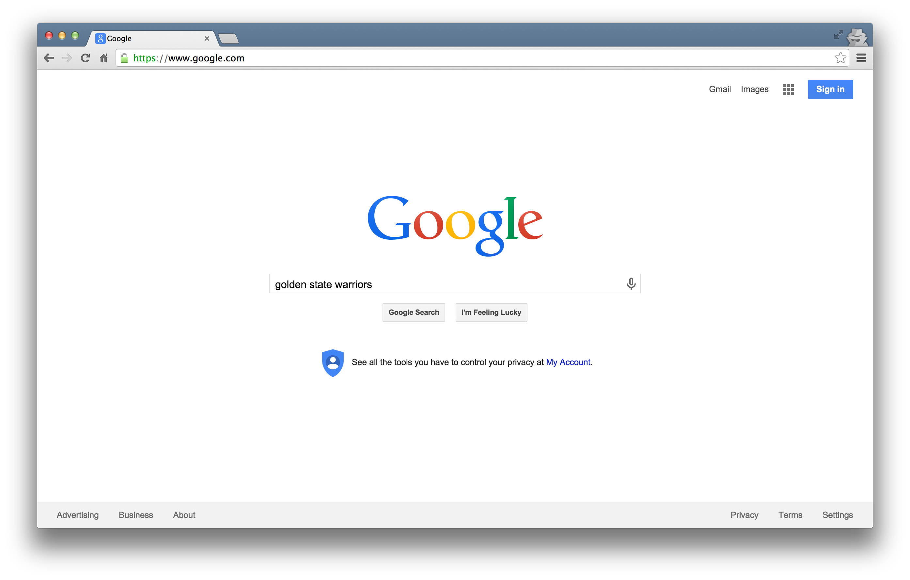
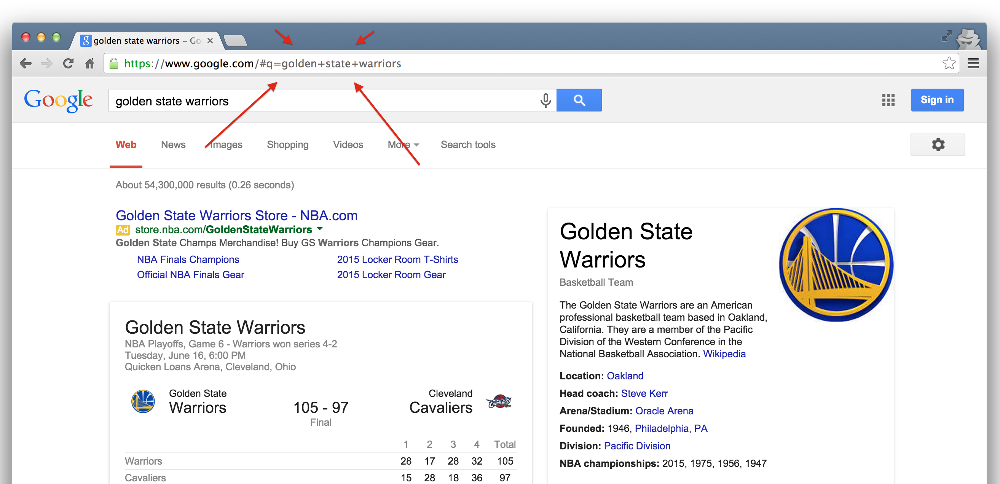
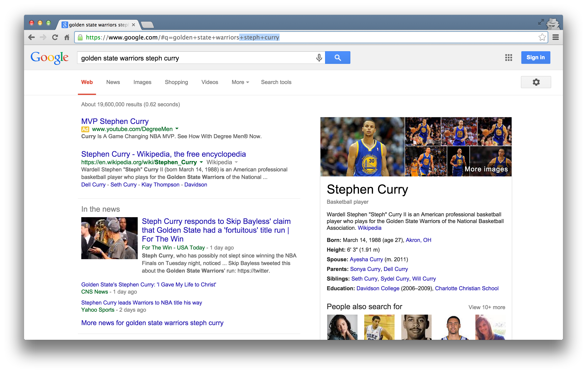
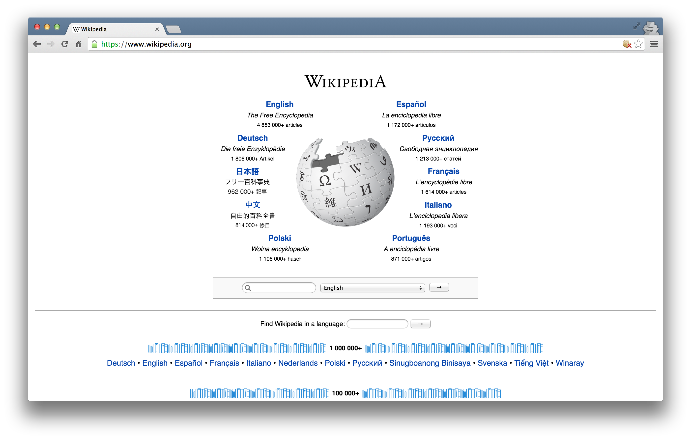
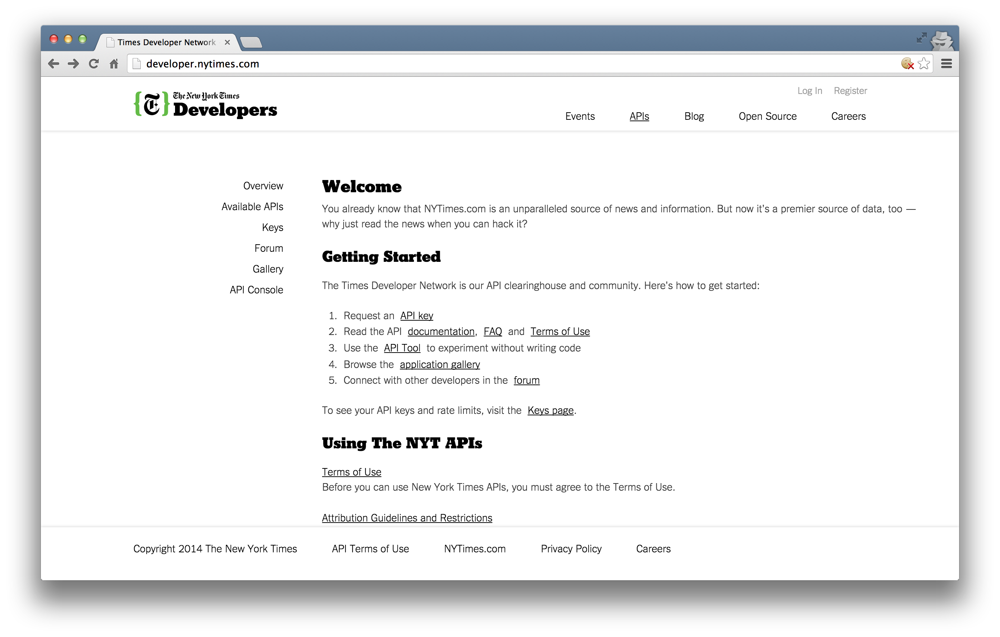
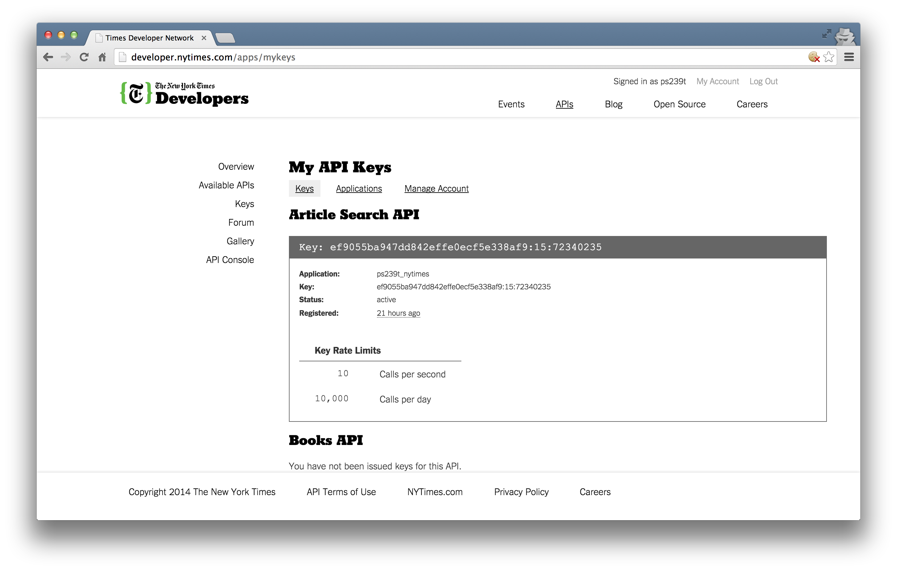
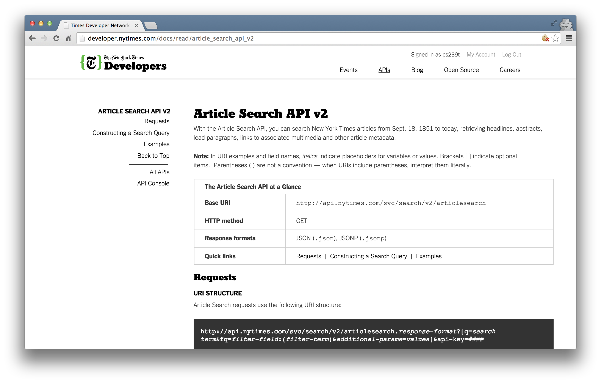

### What is an API?

* API stands for **Application Programming Interface**

* Broadly defined: a set of rules and procedures that facilitate interactions between computers and their applications

* A very common type of API is the Web API, which (among other things) allows users to query a remote database over the internet

* Web APIs take on a variety of formats, but the vast majority adhere to a particular style known as **Representational State Transfer** or **REST**

* What makes these "RESTful" APIs so convenient is that we can use them to query databases using URLs 

### RESTful Web APIs are All Around You...

Consider a simple Google search:



Ever wonder what all that extra stuff in the address bar was all about?  In this case, the full address is Google's way of sending a query to its databases asking requesting information related to the search term "golden state warriors". 



In fact, it looks like Google makes its query by taking the search terms, separating each of them with a "+", and appending them to the link "https://www.google.com/#q=".  Therefore, we should be able to actually change our Google search by adding some terms to the URL and following the general format...  



Learning how to use RESTful APIs is all about learning how to format these URLs so that you can get the response you want.

### Some Basic Terminology

* **Uniform Resource Location (URL)**: a string of characters that, when interpreted via the Hypertext Transfer Protocol (HTTP), points to a data resource, notably files written in Hypertext Markup Language (HTML) or a subset of a database.  This is often referred to as a "call".

* **HTTP Methods/Verbs**:

    + *GET*: requests a representation of a data resource corresponding to a particular URL.  The process of executing the GET method is often referred to as a "GET request" and is the main method used for querying RESTful databases.
    
    + *HEAD*, *POST*, *PUT*, *DELETE*: other common methods, though mostly never used for database querying.
    
### How Do GET Requests Work?  A Web Browsing Example

As you might suspect from the example above, surfing the web is basically equivalent to sending a bunch of GET requests to different servers and asking for different files written in HTML.

Suppose, for instance, I wanted to look something up on Wikipedia.  My first step would be to open my web browser and type in http://www.wikipedia.org.  Once I hit return, I'd see the page below.  



Several different processes occured, however, between me hitting "return" and the page finally being rendered.  In order:

1. The web browser took the entered character string and used the command-line tool "Curl" to write a properly formatted HTTP GET request and submitted it to the server that hosts the Wikipedia homepage.

2. After receiving this request, the server sent an HTTP response, from which Curl extracted the HTML code for the page (partially shown below).

3. The raw HTML code was parsed and then executed by the web browser, rendering the page as seen in the window.

```{r, echo=FALSE}
wiki<-httr::GET(url = "http://www.wikipedia.org")
body<-httr::content(x = wiki, as = "text")
substr(x = body, start = 1, stop = 1000)
```

### Web Browsing as a Template for RESTful Database Querying

The process of web browsing described above is a close analogue for the process of database querying via RESTful APIs, with only a few adjustments:

1. While the Curl tool will still be used to send HTML GET requests to the servers hosting our databases of interest, the character string that we supply to Curl must be constructed so that the resulting request can be interpreted and succesfully acted upon by the server.  In particular, it is likely that the character string must encode **search terms and/or filtering parameters**, as well as one or more **authentication codes**.  While the terms are often similar across APIs, most are API-specific.

2. Unlike with web browsing, the content of the server's response that is extracted by Curl is unlikely to be HTML code.  Rather, it will likely be **raw text response that can be parsed into one of a few file formats commonly used for data storage**.  The usual suspects include .csv, .xml, and .json files.

3. Whereas the web browser capably parsed and executed the HTML code, **one or more facilities in R, Python, or other programming languages will be necessary for parsing the server response and converting it into a format for local storage** (e.g. matrices, dataframes, databases, lists, etc.).

### QUESTION: How has Prince's popularity changed over time? 

**TASK**: Characterize the popularity of Prince over the past 10 years.  Specifically, is he "trending"?


### STEP 1: Finding Data Resources

To determine the popularity of something, we need a measurement of how frequently or widely it is referenced or encountered.  Moreover, to determine how this popularity changes over time, we need a measurement that is taken repeatedly.

Newspapers are an excellent source of such information.  The frequency with which certain items appear in its pages can be a decent metric of its popularity, and its continual publication creates a built-in time series.  And while there are a variety of newspapers to choose from, we'll be working with the New York Times for a variety of reasons --- including its status as a paper of record, its long publishing history, and (most importantly) its convenient article API.

[NYT Article API](http://developer.nytimes.com/)



### STEP 2: Getting API Access

For most APIs, a key or other user credentials are required for any database querying.  Generally, this requires that you register with the organization.  Most APIs are set up for developers, so you'll likely be asked to register an "application".  All this really entails is coming up with a name for your app/bot/project, and providing your real name, organization, and email.  Note that some more popular APIs (e.g. Twitter, Facebook) will require additional information, such as a web address or mobile number.

Once you've successfully registered, you will be assigned one or more keys, tokens, or other credentials that must be supplied to the server as part of any API call you make.  To make sure that users aren't abusing their data access privileges (e.g. by making many rapid queries), each set of keys will be given several **rate limits** governing the total number of calls that can be made over certain intervals of time.  For the NYT Article API, we have relatively generous rate limits --- 10 calls per second and 10,000 calls per day.

[NYT Article API Keys](http://developer.nytimes.com/apps/mykeys)



### STEP 3: Learning how to Construct API GET Requests

Likely the most challenging part of using web APIs is learning how to format your GET request URLs.  While there are common architectures for such URLs, each API has its own unique quirks.  For this reason, carefully reviewing the API documentation is critical.

Most GET request URLs for API querying have three or four components:

1. *Base URL*: a link stub that will be at the beginning of all calls to a given API; points the server to the location of an entire database

2. *Search Parameters*: a character string appended to a base URL that tells the server what to extract from the database; basically a series of filters used to point to specific parts of a database

3. *Authenication Key/Token*: a user-specific character string appended to a base URL telling the server who is making the query; allows servers to efficiently manage database access

4. *Response Format*: a character string indicating how the response should be formatted; usually one of .csv, .json, or .xml

Fortunately, the NYT Article API is [very well documented](http://developer.nytimes.com/docs/read/article_search_api_v2)!



### STEP 4: Constructing API GET Requests in R

See `lecture-code.ipynb` to continue!

Note: `lecture-code-r.Rmd` is supplementary material to teach you how to construct GET requests in `R`.


### Try it out!

http://developer.nytimes.com/io-docs


.
