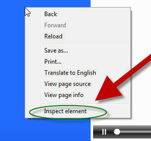

# Webscraping

> ## Learning Objectives
>
> *   Explain the difference between webscraping and working with APIs
> *   Understand how HTML works with your browser to display a website
> *   Identify HTML tags and attributes
> *   Understand how CSS works to format a website
> *   Identify CSS selectors
> *   Alter a website using Google Developer Tools.

## Why Webscrape

* Tons of web data useful for social scientists and humanists
	* social media
	* news media
	* government publications
	* organizational records

* Two kinds of ways to get data off the web
	* Webscraping - i.e. user-facing websites for humans (this week)
	* APIs - i.e. application-facing, for computers (next week)

## Webscraping v. APIs

* Webscraping Benefits
	* Pretty much any content that can be viewed on a webpage can be scraped. (https://blog.hartleybrody.com/web-scraping/)
	* No API needed
	* No rate-limiting or authentication (usually)

* Webscraping Challenges
	* Rarely tailored for researchers
	* Messy, unstructured, inconsistent
	* Entirely site-dependent

* Rule of thumb:
    - Check for API first. If not available, scrape.

## Some Disclaimers

* Check a site's terms and conditions before scraping.
* Be nice - don't hammer the site's server.
* Sites change their layout all the time. Your scraper will break.
 
## What's a website

* Some combination of codebase, database
* The "front end" product is HTML + CSS stylesheets + javascript


* Your browser turns that into a tidy layout


## HTML: Basic structure

```html
<!DOCTYPE html>
<html>
	<head>
		<title>Page title</title>
	</head>
 	<body>
 		<p>Hello world!</p>
 	</body>
</html>
```

## HTML is a Tree


## Document Object Model

Most modern browsers have a parser that reads in the HTML document, parses it into a DOM (Document Object Model) structure, and then renders the DOM structure.

Much like HTTP, the DOM is an agreed-upon standard.

The DOM is much more than what I've described, but for our purposes, what is most important to understand is that the text is only one part of an HTML element, and we need to select it explicitly.

## DOM


## HTML Elements

Generally speaking, an HTML element has three components:

1. Tags (starting and ending the element)
2. Atributes (giving information about the element)
3. Text, or Content (the text inside the element)


## HTML: Tags


[Image credit](http://miriamposner.com/blog/wp-content/uploads/2011/11/html-handout.pdf)

## Common HTML tags

| Tag        | Meaning           | 
| ------------- |-------------  |
| `<head>`     | page header (metadata, etc | 
| `<body>`     | holds all of the content |
| `<p>` | regular text (paragraph) |
| `<h1>`,`<h2>`,`<h3>` | header text, levels 1, 2, 3  |
| `ol,`,`<ul>`,`<li>` | ordered list, unordered list, list item |
| `<a href="page.html">` | link to "page.html" |
| `<table>`,`<tr>`,`<td>`  | table, table row, table item |
| `<div>`,`<span` | general containers |

## HTML Attributes

* HTML elements can have attributes.
* Attributes provide additional information about an element.
* Attributes are always specified in the start tag.
* Attributes come in name/value pairs like: name="value"


## CSS

* CSS = Cascading Style Sheet. 
* CSS defines how HTML elements are to be displayed
* HTML came first. But it was only meant to define content, not format it. While HTML contains tags like `<font>` and `<color>`, this is a very inefficient way to develop a website.
* To solve this problem, CSS was created specifically to display content on a webpage. Now, one can change the look of an entire website just by changing one file.
* Most web designers litter the HTML markup with tons of `classe`s and `id`s to provide "hooks" for their CSS.
* You can piggyback on these to jump to the parts of the markup that contain the data you need.

## CSS Anatmy

* Selectors
    - Element selector: `p`)
    - Class selector:  `p class="blue"`
    - I.D. selector: `p id="blue"`

* Declarations
    - Selector: `p`
    - Property: `background-color`
    - Value: `yellow`

* Hooks


## CSS + HTML

```html
<body>
	<table id="content">
    	<tr class='name'>
        	<td class='firstname'>
         		Kurtis
        	</td>
        	<td class='lastname'>
          		McCoy
        	</td>
    	</tr>
    	<tr class='name'>
      		<td class='firstname'>
          		Lea
        	</td>
        	<td class='lastname'>
          		Guerrero
     		</td>
    	</tr>
 	</table>
</body>
```

> #### Exercises 1
> 
> Find the CSS selectors for the following elements in the HTML above.
> (Hint: There will be multiple solutions for each)
> 
> 1. The entire table
> 2. The row containing "Kurtis McCoy"
> 3. Just the element containing first names
> 

## Why This Matters

Basic strategy of webscraping:

1. Use your browser‘s “inspector” to discover what kind of HTML element your
data is in.
2. Think about how you can differentiate those elements from other, similar elements in the webpage using CSS.
3. Use Python and add-on modules like BeautifulSoup to extract just that data.

## Inspect Element

Google Chrome comes with great developer tools to help parse a webpage.



The inspector gives you the HTML tree, as well as all the CSS selectors and style information.


> #### Exercise 2
> 
> Go to http://rochelleterman.github.io/. Using Google Chrome's inspect element:
> 
> 1. Change the background color of each of the rows in the table
> 2. Find the image source URL
> 3. Find the HREF attribute of the link.
> 
> Useful CSS declarations [here](http://miriamposner.com/blog/wp-content
> uploads/2011/11/usefulcss.pdf)

## Putting it all together:

1. Use Inspect Element to see how your data is structured
2. Pay attention to HTML tags and CSS selectors
3. Pray that there is some kind of pattern
4. Leverage that pattern using Python

> #### Exercise 3
> 
> Go to any website, and redesign the site using Google Chrome's inspect 
> element.

## Scraping Multiple Pages

* Today we just scraped one webpage. But what if you wanted to do many?
* Two solutions:
    - URL patterns
    - Crawling

**To the jupyter notebook!**
